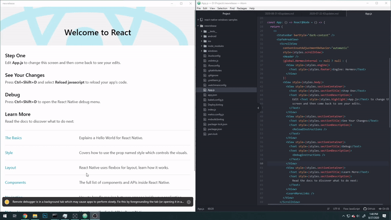
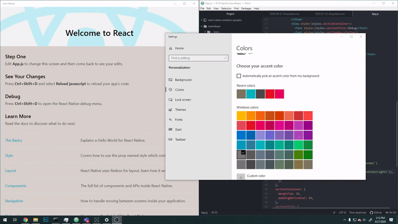

React Native for Windows is now on a [0.63]() stable release with React Native core, lighting up some fun new APIs.

<!--truncate-->

Both React Native for Windows and macOS have been bumped up a version - to 0.63 for Windows and 0.62 for macOS!

This means Windows is once again up-to-date with React Native core and following this new release we're lighting up a lot of new APIs and dev experiences that make developing on Windows using React Native that much better.

Check out the updated Getting Started guides for [Windows](https://microsoft.github.io/react-native-windows/docs/getting-started) and [macOS](https://microsoft.github.io/react-native-windows/docs/rnm-getting-started) to try out to new features for yourself!

# Developer Experience Improvements
With the new 0.63 version we'll be taking advantage of a few really great improvements to the developer experience that were added by the React Native core team.

## LogBox

LogBox is now on by default for React Native apps on Windows! This is a huge step forward in addressing some of the pain points experienced by developers when trying to debug their apps.

With this new update you can now more clearly read errors in a concise, formatted, and actionable layout that's easy on the eyes and the mind - a win-win!

Check out the [official blog post](https://reactnative.dev/blog/2020/07/06/version-0.63#logbox) for more information around this feature.

## Autolinking

Sometimes it really is the little things that make a huge difference and in this case Autolinking is no exception!

Now when you install new modules and build your app we will automatically hook-up all those necessary native platform-specific code pieces for you in Windows. This will save you time and (possibly) a headache, if C++ isn't your strong suite.

We've also provided some new documentation around how to use [Autolinking with Native Modules](https://microsoft.github.io/react-native-windows/docs/native-modules-autolinking) in Windows.

## ReactNotificationService

lorem

# PlatformColor

PlatformColor is a new API React Native core introduced that gives React Native app components the ability to leverage native system colors - meaning you can now subscribe to certain colors or brushes in your `StyleSheet` that respond to native platform actions like theme switching, user accent colors, or high contrast changes.

Head over the [official blog post](https://reactnative.dev/blog/2020/07/06/version-0.63#native-colors-platformcolor-dynamiccolorios) about this API to learn more about accessing native colors across all platforms, or check out our [new page on PlatformColor](https://microsoft.github.io/react-native-windows/docs/windowsbrush-and-theme) to learn how to take advantage of Windows-specific colors and materials in your app.

# Community Modules
lorem

## ReactNavigation

lorem

> sync with Steven on any more modules we might've added

# Hermes on macOS
lorem

# What We've Been Doing
- point to talks (previous and upcoming)

## Did you know?
xbox is using RNW

# Coming up next
