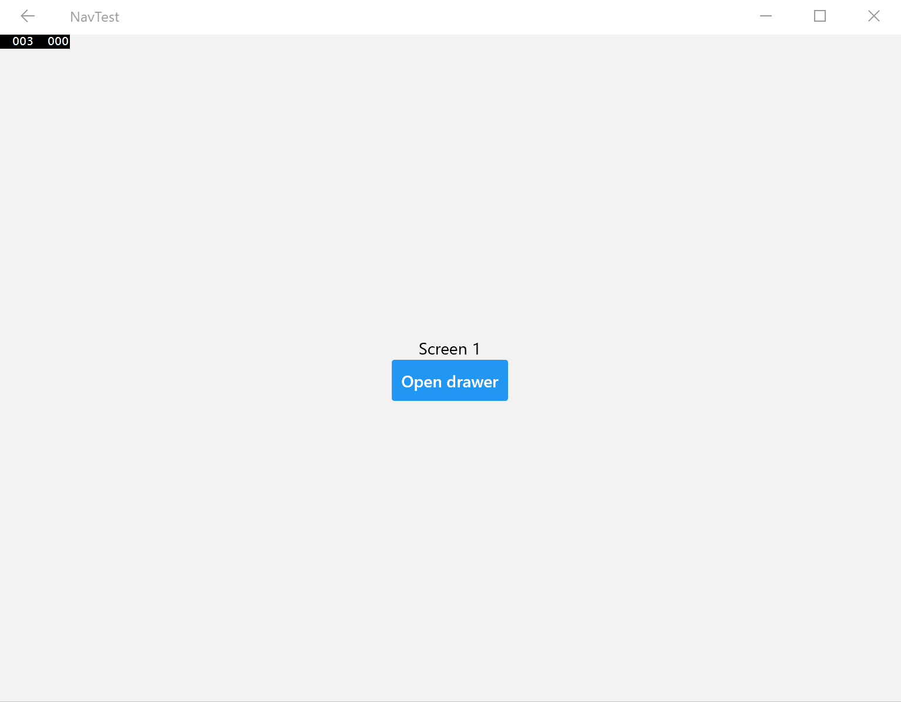

React Native for Windows is now on a [0.63]() stable release with React Native core, lighting up some fun new APIs.

<!--truncate-->

Both React Native for Windows and macOS have been bumped up a version - to 0.63 for Windows and 0.62 for macOS!

This means Windows is once again up-to-date with React Native core and following this new release we're lighting up a lot of new APIs and dev experiences that make developing on Windows using React Native that much better.

Check out the updated Getting Started guides for [Windows](https://microsoft.github.io/react-native-windows/docs/getting-started) and [macOS](https://microsoft.github.io/react-native-windows/docs/rnm-getting-started) to try out the new features for yourself!

# Developer Experience Improvements
With the new 0.63 version we'll be taking advantage of a few really great improvements to the developer experience that were added by the React Native core team.

## LogBox

LogBox is now on by default for React Native apps on Windows! This is a huge step forward in addressing some of the pain points experienced by developers when trying to debug their apps.

With this new update you can now more clearly read errors in a concise, formatted, and actionable layout that's easy on the eyes and the mind - a win-win!

Check out the [official blog post](https://reactnative.dev/blog/2020/07/06/version-0.63#logbox) for more information around this feature.

## Autolinking

Sometimes it really is the little things that make a huge difference and in this case Autolinking is no exception!

Now when you install new modules and build your app we will automatically hook-up all those necessary native platform-specific code pieces for you in Windows. This will save you time and (possibly) a headache, if C++ isn't your strong suit.

We've also provided some new documentation around how to use [Autolinking with Native Modules](https://microsoft.github.io/react-native-windows/docs/native-modules-autolinking) in Windows.

# PlatformColor

`PlatformColor` is a new API React Native core introduced that gives React Native app components the ability to leverage native system colors - meaning you can now subscribe to certain colors or brushes in your `StyleSheet` that respond to native platform actions like theme switching, user accent colors, or high contrast changes.

Head over to the [official blog post](https://reactnative.dev/blog/2020/07/06/version-0.63#native-colors-platformcolor-dynamiccolorios) about this API to learn more about accessing native colors across all platforms, or check out our [new guidance documentation on PlatformColor](https://microsoft.github.io/react-native-windows/docs/windowsbrush-and-theme) to learn how to take advantage of Windows-specific colors and materials in your app.

> Since the release of this API, the older Windows `AppTheme` API will be deprecated in favor of `PlatformColor`.

# Pressable

[Pressable](https://reactnative.dev/docs/pressable) is now available on React Native for Windows apps as well. This new core API helps make customizing your interaction experiences more robust and easier to fit around your custom components and scenario needs.

# Community Modules

As with every big release, we're still working hard at adding Windows implementations to important community modules.

Come check out what we've enabled for you this release!

## react-navigation

One of the more popular and much needed [react-navigation](https://github.com/react-navigation/react-navigation/tree/main/packages/native) module is now supported on Windows. Navigate between screens with native ease and preserve your stack history in this amazing community module.

## react-native-checkbox

The community module [react-native-checkbox](https://github.com/react-native-community/react-native-checkbox) has also received Windows support this release. CheckBox is a rather unique native control for us and we're happy to have it in.

Special shoutout and thank you to the [community members who helped make this possible!](https://github.com/react-native-community/react-native-checkbox/pull/68)

# The Hermes Engine

[The Hermes Engine](https://hermesengine.dev/) is an open-source JavaScript engine that's been built to optimize the performance of React Native apps. It's currently opt-in for Android and macOS and we're in the process of bringing it to React Native Windows as well.

If you'd like to experiment with it in your Windows or macOS React Native apps, [head over to our guidance page](https://microsoft.github.io/react-native-windows/docs/hermes) to learn more about it.

# What We've Been Doing

Saying that working from home has taken some getting used to would be an understatement - it's been an incredible, eye-opening, stressful, and amazing adventure so far, obviously for many reasons both within and outside of work.

However, that hasn't stopped us from trying to stay connected (virtually) with the passionate and awesome community that is React Native and cross-platform developers.

Check out some of the events we've done and will be doing:

## React Wednesdays with digitalprimates

In mid August we connected with the folks over at [CodeItLive](https://www.twitch.tv/codeitlive) to talk about React Native on Windows and macOS:

<iframe width="560" height="315" src="https://www.youtube.com/watch?v=1wk-Id0fgqE" frameborder="0" allow="accelerometer; autoplay; encrypted-media; gyroscope; picture-in-picture" allowfullscreen></iframe>

## [React Native EU Virtual Edition](https://www.react-native.eu/)

Looking a bit forward, check out the React Native EU conference hosted by Callstack, where our very own [Steven Moyes](https://twitter.com/moyessa) will be presenting about React Native for Desktops and Dual Screens.

This talk covers building React Native apps that target Windows, macOS, and the new Surface Duo device - [Check it out!](https://www.react-native.eu/)

# Coming up next

On top of our continued quest to stay on the latest version of React Native core, there's a lot we're also looking into all the time on our [GitHub repo](https://github.com/microsoft/react-native-windows/) to help deliver the next best thing for you every release.

For APIs that includes things like flushing out mouse and keyboard support, experimenting more with Hermes on Windows, and of course adding Windows support to even more community modules, like [react-native-gesture-handler](https://github.com/software-mansion/react-native-gesture-handler), [react-native-svg](https://github.com/react-native-community/react-native-svg), [react-native-config](https://github.com/luggit/react-native-config), [and more!](https://github.com/microsoft/react-native-windows/issues?q=is%3Aopen+is%3Aissue+label%3AExtensions)
